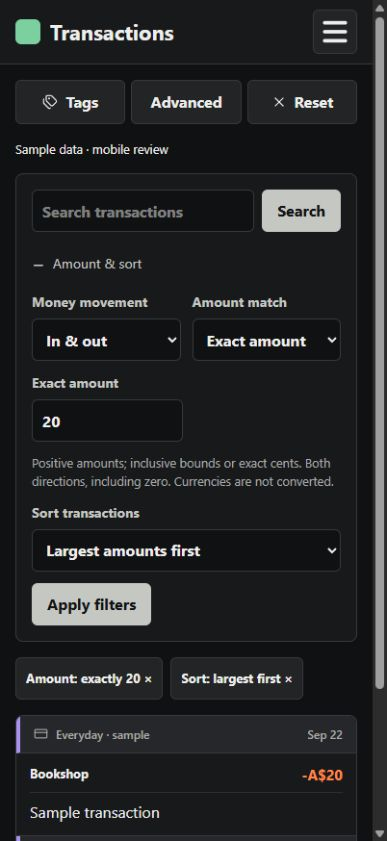

# Transaction search (#27)

Validated against main at 210d846. Browser checks used a 402 × 874 CSS-pixel portrait viewport (iPhone 18 Pro proportions), not physical-device Safari testing.

- 49 transaction-search API tests passed, including isolated PostgreSQL coverage.
- 5 URL serialization/compatibility tests passed: `node --experimental-strip-types --test src/Finyte.Web/tests/transactionSearch.test.mjs`.
- Frontend build and lint passed; build reports the existing large-bundle warning.
- Mobile browser checks: visible merchant search, clear search, positive money-out range, largest-first sorting, exact amounts, money-in and mixed directions, range validation, pagination, chip removal, Back navigation, and Advanced apply/cancel with signed amounts.
- Existing imported data was used for read-only application checks. Compact controls measured 132 CSS pixels tall; the first matching result was visible at y=406 in the 874-pixel viewport.
- Follow-up mobile checks: search does not apply hidden draft amount changes, invalid ranges remain editable, applying filters collapses the editor, exact mixed-direction matches return both +30 and -30, and Advanced cancellation preserves applied filters.
- Screenshots use the real filter, drawer and transaction-card components with clearly labelled synthetic transactions. Open /tests/mobile-review.html on the Vite development server to reproduce them; the fixture makes no API calls or database changes and is not a production entry point.
- Saved PNGs were reopened and visually inspected. These illustrate layout; filtering correctness was verified separately against the running application and API tests.

| Applied range and results | Applied exact amount and results |
| --- | --- |
|  |  |

| Expanded everyday controls | Advanced filters |
| --- | --- |
|  |  |
