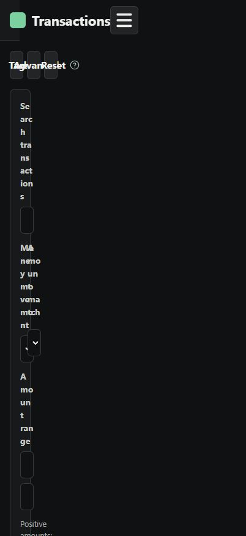
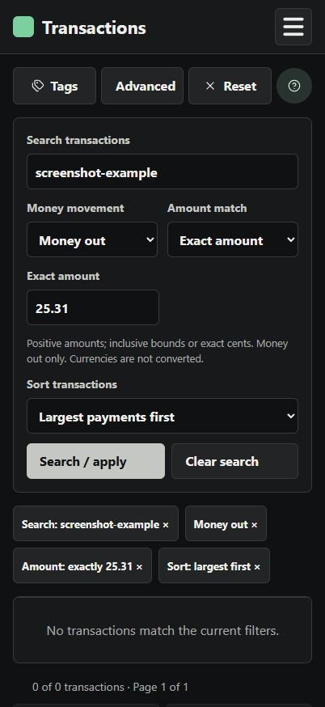
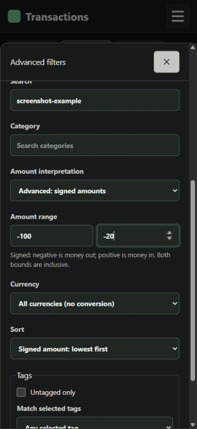

# Transaction search (#27)

Validated against main at 210d846. Browser checks used a 402 × 874 CSS-pixel portrait viewport (iPhone 18 Pro proportions), not physical-device Safari testing.

- 49 transaction-search API tests passed, including isolated PostgreSQL coverage.
- 5 URL serialization/compatibility tests passed: `node --experimental-strip-types --test src/Finyte.Web/tests/transactionSearch.test.mjs`.
- Frontend build and lint passed; build reports the existing large-bundle warning.
- Mobile browser checks: visible merchant search, clear search, positive money-out range, largest-first sorting, exact amounts, money-in and mixed directions, range validation, pagination, chip removal, Back navigation, and Advanced apply/cancel with signed amounts.
- Existing imported data was used for read-only checks. Screenshots deliberately use a no-result search to avoid publishing personal transactions.

| Positive range | Exact amount | Advanced signed controls |
| --- | --- | --- |
|  |  |  |
