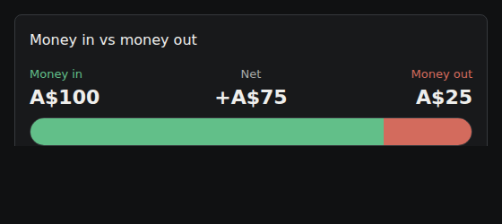

# Issue 63 verification

Base: remote main `f5509d09ea67f3355532da342103d5508a045baf`.
Branch: `claude/issue-63-currency-scope`.

Covers #63 in full, and the labelling half of #38 (its first acceptance criterion). #38 stays open — the
gross-versus-net refund policy it also asks for is a product decision and is not attempted here.

## Automated checks

- `npx tsc -b`: passed.
- `npm run lint`: passed.
- `node --test src/Finyte.Web/tests/*.mjs`: 5 passed.
- **`dotnet test` was not run.** There is no .NET SDK in the authoring environment, so every C# change here is
  read-verified only. `tests/Finyte.IntegrationTests/OverviewCurrencyScopeTests.cs` is new and has never been
  executed — its expected values are derived by hand from the seed, so treat a failure as suspect-test-first.

## What the test asserts

Two accounts, `Everyday` (AUD, balance 500) and `Savings` (USD, balance 900), each with one credit and one
debit in August 2026. `AnalyticsCurrency` picks AUD because `Everyday` sorts first by display name, which is
why the seed names them that way — the assertions depend on that ordering being deterministic.

| Figure | Expected | Why |
| --- | --- | --- |
| `Currency` | `AUD` | unchanged selection rule |
| `CashFlowRace.IncomeMinorUnits` | 10000 | AUD credit only; the USD 400 is not added |
| `CurrentMonthSpendMinorUnits` | 2500 | AUD debit only; the USD 70 is not added |
| `AccountBalanceMinorUnits` | 50000 | AUD account only; the USD 900 is not added |
| `CurrencyScope.ExcludedAccounts` | 1 | the USD account |
| `CurrencyScope.ExcludedTransactions` | 2 | both USD transactions |
| `BalanceCoverage.TotalAccounts` | 1 | coverage is now scoped to the reporting currency too |

A second case seeds a single-currency household and asserts the excluded counts are zero and the currency list
is empty, so the change is a no-op for the common case.

## Browser checks

None. The app cannot be run here — no .NET SDK means no API, so the dashboard cannot be loaded end to end.

The screenshot below is the real `CashFlowRace` component rendered through a temporary Vite harness with the
production stylesheets and a fixture `OverviewResponse`. It shows the #38 relabelling only. It is not a
screenshot of the running application, and the empty-state, multi-currency note and balance tile are unverified
visually.

Captured at 560 CSS pixels wide rather than a phone viewport: at 402 the panel overflowed its container in the
harness and clipped the right-hand label. I could not confidently tell whether that is a harness artifact or a
real narrow-viewport overflow in `.cash-flow-values`, so it is worth checking on a real phone viewport.

## Not covered

- The currency *selection* rule is unchanged: `AnalyticsCurrency` still returns the first account's currency by
  display name. That is arbitrary — it is not the dominant currency or a user choice. This change makes the
  resulting scope visible rather than fixing how it is chosen. Worth revisiting alongside #39.
- Refund and net-of-spending semantics from #38.
- Budgets, pay cycles and recurring payments already scope themselves to a single currency and were not
  touched.
